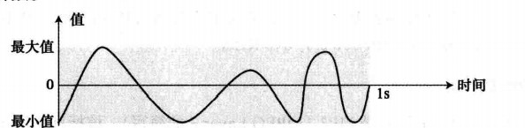
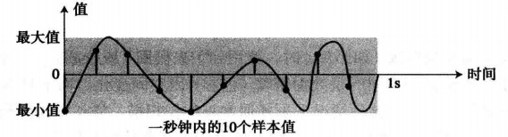

# 存储音频

看下面这张图：

现在我们以一秒为单位存储音频
存储音频实际上就是为了还原原先音频的原态，我们可以每秒钟读取n次，记录其值，便能够将音频记录下来

如图所示：

这个过程称为**采样**

> 采样率：
> 每秒采取多少个样本

> 量化
> 采用测量的值是真实的数字，很可能是小数，但是为每个样本使用一个整数(原文：无符号的数)会更加简便，量化便是将样本的值截取为最接近的整数值的一种过程
> 例如实际值为17.2，可截取为17；如果为17.8，可截取为18

> 每样本位
> 对每个样本需要决定分配多少位（也称为位深度）

> 位率
> 即耗费空间的速度
> 如每秒400个样本，每个样本占8位（每样本位为8），则位率为：400*8 = 3200 b/s

> 声音编码标准
> 现在音频编码的主流标准是 MP3（MPEG Layer3）
> 采用每秒44100个样本，每样本位为16，位率705600 b/s，再去掉那些人耳无法识别的信息压缩方法进行压缩
> 这是一种有损压缩法

