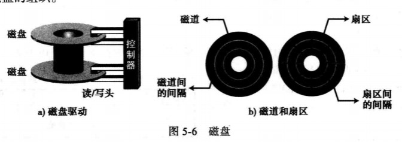

# 输入/输出子系统

## 非存储设备  

> 非存储设备是的CPU/内存可以与外界通信  
> 但他们不能存储信息

1. 键盘和监视器

> 键盘提供输入功能  
> 监视器显示输出并同时相应键盘的输入  
> 此类中其他的设备还有鼠标，操纵杆等

2. 打印机

> 用于产生永久性记录的输出设备  
> 非存储设备，因为要打印的材料不能够直接由打印机输入计算机中，而且不能再次利用，除非有人通过打字或扫描的方式再次输入计算机中

## 存储设备

> 虽然存储设备被分为输入/输出设备，但它可以存储大量的信息以备后用  
> 比主存便宜的多，且存储的信息也不易丢失（断电也不会丢失）  
> 有时称他们位辅助存储设备  
> 通常分为磁介质和光介质

1. 磁介质存储设备 

> 使用磁性来存储位数据  
> 如果一点有磁性则表示1，没有则表示0  

1) 磁带

> 大小不一，最普通的一种是用厚磁膜封装的半英寸塑料磁带  
> 磁带用两个滚轮承接起来，转动的磁带通过读/写磁头的适合，便可以通过磁头来读写磁带上的数据  
> ***

* 表面结构
> 磁带的宽度分为九个磁道，  
> 磁道上的每个点可以存储一位的信息  
> 九个点存储8位（1字节）的信息，还有一位用作错误检测

* 数据存取
> 顺序存取设备  
> 磁带表面可能会分为若干块，但是没有寻址装置来读取每个块  
> 故想要读取指定的块就要按照顺序通过其前面所有的块

* 性能
> 磁带速度较慢  
> 但是它非常便宜  
> 现在人们用磁带来存储大容量的数据

2) 磁盘

> 由一张一张的磁片叠加而成，这些磁片由薄磁膜封装起来  
> 通过盘上每一个此片的读写磁头读写磁介质表面来进行读取和存储的  

* 表面结构 

每个盘面都被划分成磁道，每个磁道又被划分为若干扇区  
磁道间通过**磁道内部间隔**隔开，扇区之间通过**扇区内部间隔** 隔开

* 数据存取

> 是随机存取设备  
> 可以随机存取，但是在某一时间可以读取的最小的存储区域只能是一个扇区  
> 数据块可以存储在一个或多个扇区上，且该信息的获取不需要通过读取磁盘上的其他信息  

* 性能
  
> 取决于几个因素  
> 角速度  定义了磁盘的旋转速度  
> 
> 寻道时间  定义了读写磁头寻找数据所在磁道的时间  
> 
> 传送时间  定义了将数据从磁盘移到CPU/内存所需的时间

2. 光存储设备

> 使用光（激光）技术来存储和读取数据  
> 在发明了CD（光盘）后人们利用光存储技术来保存音频信息  
> 现在相同的技术（稍作改进）被用于存储计算机上的信息  
> 使用这种技术的设备有只读光盘（CD-ROM），可刻录光盘（CD-R），可重写光盘（CD-RW），数字多功能光盘（DVD）
o

1) CD-ROM

> 只读光盘使用与CD光盘相同的技术、（最初是飞利浦和索尼公司为录制音乐而研发的）  
> 两者区别是增强成都不同：CD-ROM更健壮，且纠错能力较强

* 制造
> CD-ROM技术需要分三步来制造大量的光盘
> a. 使用高能红外激光再塑料层上刻写位模式来制造**主盘**。激光束使位模式变成一系列的坑（有洞） 和 纹间表面（没有洞），坑洞常表示0，纹间表面则通常表示1，反过来表示也可以。另一种方法是将过度部分（坑到懂或者洞到坑）表示1，而非过度部分表示0
> b. 依照主板，做成相应的磨具。在模盘中，坑洞则由凸起代替  
> c. 溶解的**聚碳酸铜树脂**被注入模盘中以生产像主盘中一样的坑，同时把一层非常薄的铝（作为一层反射表面）加到聚碳酸铜树脂上，任何在反射表面的上面还要加上一层保护漆和标签。 在制造光盘中只有这一步对于每一张光盘都需要

