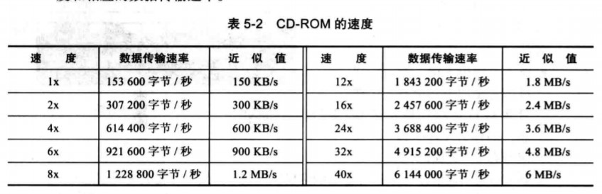

# 输入/输出子系统

## 非存储设备  

> 非存储设备是的CPU/内存可以与外界通信  
> 但他们不能存储信息

1. 键盘和监视器

> 键盘提供输入功能  
> 监视器显示输出并同时相应键盘的输入  
> 此类中其他的设备还有鼠标，操纵杆等

2. 打印机

> 用于产生永久性记录的输出设备  
> 非存储设备，因为要打印的材料不能够直接由打印机输入计算机中，而且不能再次利用，除非有人通过打字或扫描的方式再次输入计算机中

## 存储设备

> 虽然存储设备被分为输入/输出设备，但它可以存储大量的信息以备后用  
> 比主存便宜的多，且存储的信息也不易丢失（断电也不会丢失）  
> 有时称他们位辅助存储设备  
> 通常分为磁介质和光介质

1. 磁介质存储设备 

> 使用磁性来存储位数据  
> 如果一点有磁性则表示1，没有则表示0  

1) 磁带

> 大小不一，最普通的一种是用厚磁膜封装的半英寸塑料磁带  
> 磁带用两个滚轮承接起来，转动的磁带通过读/写磁头的适合，便可以通过磁头来读写磁带上的数据  
> ***

* 表面结构
> 磁带的宽度分为九个磁道，  
> 磁道上的每个点可以存储一位的信息  
> 九个点存储8位（1字节）的信息，还有一位用作错误检测

* 数据存取
> 顺序存取设备  
> 磁带表面可能会分为若干块，但是没有寻址装置来读取每个块  
> 故想要读取指定的块就要按照顺序通过其前面所有的块

* 性能
> 磁带速度较慢  
> 但是它非常便宜  
> 现在人们用磁带来存储大容量的数据

2) 磁盘

> 由一张一张的磁片叠加而成，这些磁片由薄磁膜封装起来  
> 通过盘上每一个此片的读写磁头读写磁介质表面来进行读取和存储的  

* 表面结构 

每个盘面都被划分成磁道，每个磁道又被划分为若干扇区  
磁道间通过**磁道内部间隔**隔开，扇区之间通过**扇区内部间隔** 隔开

* 数据存取

> 是随机存取设备  
> 可以随机存取，但是在某一时间可以读取的最小的存储区域只能是一个扇区  
> 数据块可以存储在一个或多个扇区上，且该信息的获取不需要通过读取磁盘上的其他信息  

* 性能
  
> 取决于几个因素  
> 角速度  定义了磁盘的旋转速度  
> 
> 寻道时间  定义了读写磁头寻找数据所在磁道的时间  
> 
> 传送时间  定义了将数据从磁盘移到CPU/内存所需的时间

2. 光存储设备

> 使用光（激光）技术来存储和读取数据  
> 在发明了CD（光盘）后人们利用光存储技术来保存音频信息  
> 现在相同的技术（稍作改进）被用于存储计算机上的信息  
> 使用这种技术的设备有只读光盘（CD-ROM），可刻录光盘（CD-R），可重写光盘（CD-RW），数字多功能光盘（DVD）
o

1) CD-ROM

> 只读光盘使用与CD光盘相同的技术、（最初是飞利浦和索尼公司为录制音乐而研发的）  
> 两者区别是增强成都不同：CD-ROM更健壮，且纠错能力较强

* 制造
> CD-ROM技术需要分三步来制造大量的光盘
> a. 使用高能红外激光再塑料层上刻写位模式来制造**主盘**。激光束使位模式变成一系列的坑（有洞） 和 纹间表面（没有洞），坑洞常表示0，纹间表面则通常表示1，反过来表示也可以。另一种方法是将过度部分（坑到懂或者洞到坑）表示1，而非过度部分表示0
> b. 依照主板，做成相应的磨具。在模盘中，坑洞则由凸起代替  
> c. 溶解的**聚碳酸铜树脂**被注入模盘中以生产像主盘中一样的坑，同时把一层非常薄的铝（作为一层反射表面）加到聚碳酸铜树脂上，任何在反射表面的上面还要加上一层保护漆和标签。 在制造光盘中只有这一步对于每一张光盘都需要

* 读

> CD-ROM依靠计算机光驱的低能光束读信息  
> 激光束经过纹间表面会被铝制的表射层反射回来  
> 经过坑处时会被反射两次：一次是被坑的边缘反射，一次是被铝制表射层的边界反射  
> 这两次反射有破坏性的影响，因为坑的深度是精确选定的，为激光束波长的四分之一  
> 装在驱动器上的感应器对于某个的是纹间表面是，应该探测到多一些的光信号，反之是坑时就少一点，依次读出记录在原始主盘上的信息

* 格式 

> 其工艺使用和磁盘不同的格式  
> CD-ROM的格式是基于：
> a. 使用汉明码的纠错技术将8位的数据块转换成14位的符号
> b. 一个帧由42个符号组成（14位/符号）
> c.一个扇区由98个帧组成（2352个位）

* 速度

> CD-ROM驱动器有不同的速度，单倍速称为1x，2倍速称为2x，以此类推  
> 单倍速的读取速度位153600字节/秒  
> 详见下图

* 应用 

> 如果有大量的潜在的客户，那么制造主盘，模盘和实际光盘的费用是可以调节的  
> 也就是说如果大量生成盘片，那么这项技术是非常经济的，主盘，模盘的费用占比就相对较低

2) CD-R

> CD-ROM只有在大量生产时才合理  
> 但CD-R（可刻录光盘）则可以让用户自己制作一张或更多的盘片，而不必考虑像制作CD-ROM时的一些开销  
> 非常适合做备份，用户只需要一次写入信息，就可以多次读取信息  
> 被称为：“写一次，读多次”

* 制造

> 与只读光盘的原理相同，下面是一些不同之处：
> a. 不需要主盘和模盘  
> b. 反射层材料使用金取代了铝  
> c. 盘片聚碳酸酯树脂上没有坑，盘片上的坑和纹间表面是模拟出来的（在聚碳酸酯树脂与反射层之间额外添加了类似用于相片中的某种染料）
> d. 由刻录机所产生的高能激光束在染料层上烧制深色的点（改变化学组成），用来模拟坑，没被激光所照射的区域就是纹间表面。烧制的深色的点可以吸收光使其反射减少甚至没有，与纹间表面产生对比，感应器由此确定0和1，详见读

* 读 
> CD-R上的信息可以由CD-ROM驱动器和CD-R驱动器读取  
> 着意味着任何的差别对于驱动器来说都应该是透明的  
> 相同的低能激光束经过模拟的坑和纹间表面，对于纹间表面而言，激光束到达反射层而被反射；对于模拟的坑而言，点是不透明的，激光束不会被反射回来

* 格式和速度  

> CD-R的格式、容量和速度与CD-ROM的相同

3) CD-RW

> 尽管CD-R已经很受欢迎，但他们只能被写一次  
> 为了能重写以前的资料，便产生一种新技术，制作了一种称为**可重写光盘**的新盘，也称可擦写光盘

* 制造

> CD-RW使用的技术可制作可刻录光盘的原理相同，  
> 下面是一些不同之处：  
> a. 该工艺使用了银、锢、锑、碲的合金而不是燃料，这种合金由两种稳定的状态，晶体态（透明态）和无定型态（不透明态）
> b. 驱动器使用高能激光束在合金上创建模拟的坑（由晶体态变成无定型态）

* 读

> 驱动器使用与CD-ROM和CD-R一样的低能激光束来检测是坑还是纹间表面  

* 擦除

> 驱动器使用中等能量的激光束将坑变成纹间表面，激光束将该点从无定型态转变成晶体态

* 格式和速度

> CD-RW的格式、容量和速度与CD-ROM的相同

＊　应用

> 这项技术明显比CD-R技术更有吸引力  
> 但是CD-R还是更受欢迎一点  
> 原因：  
> 第一，CD-R空盘价格比CD-RW空盘的价格要更便宜  
> 第二，CD-R在某些不允许改变光盘内容的场合下更合适

4) DVD

> CD-ROM的存储容量（650MB）已经不能满足视频信息存储的需要  
> 市场上最新的光存储设备叫做**数字多功能光盘**（DVD）  
> a. 坑更小：直径0.4微米，CD中直径位0.8微米  
> b. 磁道间更为紧密  
> c. 激光束用红激光代替了红外激光  
> d. DVD使用1~2个存储层，并且可以说单面或者双面的

* 容量

> 上述的技术改进使容量增大

* 压缩

> 使用MPEG（见15章）压缩  
> 这意味着一个单面、单层的DVD可以存储133分支的高品质视频，其中还包括音频和字幕  

* 应用

> 如今DVD以其大容量应用于许多需要存储大量数据的应用程序中

